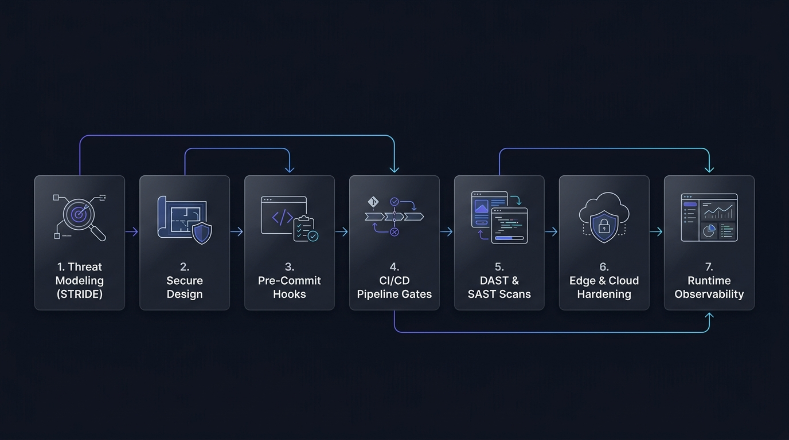
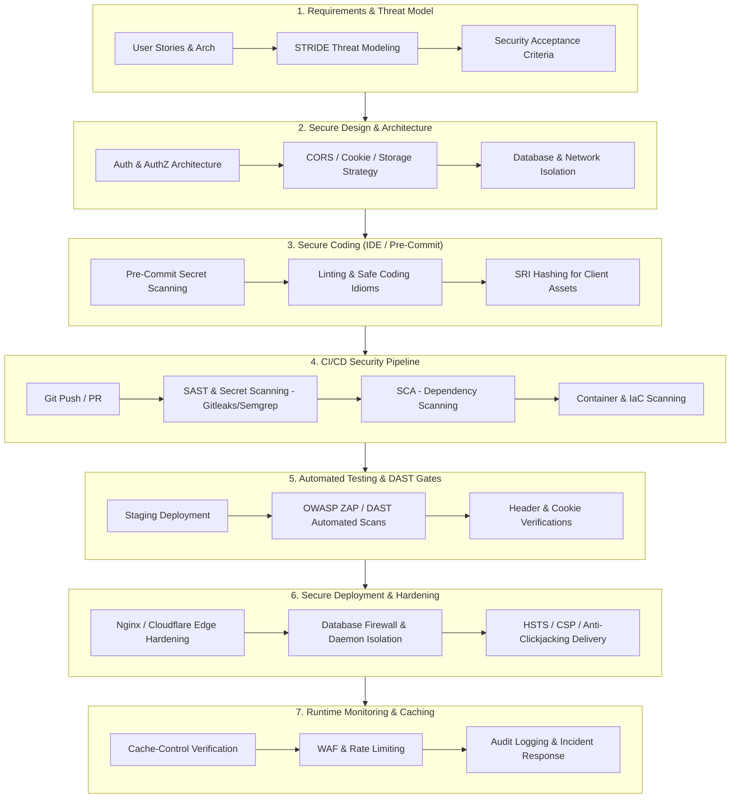

# 🛡️ Kaizo DevSec Framework (K-SEF)
### Comprehensive Developer Security Architecture, SDLC Flow & Vulnerability Remediation Matrix

> **Author**: Kaizo (Software Developer)  
> **Target Audience**: Full-stack Developers, DevOps Engineers, Security Engineers  
> **Version**: 1.0.0  
> **Scope**: Secure Software Development Lifecycle (SSDLC), DAST/SAST Finding Remediation, Security Headers, Cryptography & State Management, Database Hardening, CI/CD Pipeline Gates.

---

<p align="center">
  
</p>

---

## ⚡ Instant CLI Usage (One-Command Security)

Whenever you start a new codebase or want to audit an existing one, run the **K-SEF CLI** directly with a single command:

```bash
# 🚀 1. Scaffold security guardrails into any project (Interactive Wizard)
npx kaizo-devsec init

# 🔍 2. Audit current project for missing headers, leaked .env, & vulnerabilities
npx kaizo-devsec audit

# 🔐 3. Generate Subresource Integrity (SRI) hashes for CDN scripts
npx kaizo-devsec sri https://cdnjs.cloudflare.com/ajax/libs/axios/1.6.8/axios.min.js

# 📜 4. Instantly drop platform rules (supabase | firebase | docker | vm)
npx kaizo-devsec rules supabase
```

### 💻 One-Line Global Installation:

```bash
# Linux / macOS
curl -fsSL https://raw.githubusercontent.com/kizo-88/Kaizo-DevSec-Framework-K-SEF-/main/install.sh | bash

# Windows PowerShell
irm https://raw.githubusercontent.com/kizo-88/Kaizo-DevSec-Framework-K-SEF-/main/install.ps1 | iex
```

Once installed globally, simply run `k-sef init` in any terminal!

---

## 📑 Table of Contents

1. [Instant CLI Usage](#-instant-cli-usage-one-command-security)
2. [Executive Summary & Security Philosophy](#-executive-summary--security-philosophy)
3. [Framework Architecture & 7-Phase SDLC Flow](#-framework-architecture--7-phase-sdlc-flow)
4. [Vulnerability & Finding Matrix Overview](#-vulnerability--finding-matrix-overview)
5. [Directory & Documentation Structure](#-directory--documentation-structure)
6. [Quick Start & Developer Daily Workflow](#-quick-start--developer-daily-workflow)

---

## 🎯 Executive Summary & Security Philosophy

The **Kaizo DevSec Framework (K-SEF)** is engineered to bridge the gap between abstract cybersecurity policies and concrete developer-level execution. Security is not an afterthought or an obstacle at the end of a sprint—it is built into every architectural decision, commit, pull request, and deployment.

### Core Principles

```
┌─────────────────────────────────────────────────────────────────────────────┐
│                            KAIZO DEVSEC PILLARS                             │
├───────────────────┬───────────────────┬──────────────────┬──────────────────┤
│ 1. Shift-Left     │ 2. Defense in     │ 3. Zero Trust &  │ 4. Deterministic │
│    Validation     │    Depth          │    Least Priv.   │    Remediation   │
│                   │                   │                  │                  │
│ Validate code,    │ Never rely on a   │ Never expose     │ Fix root causes  │
│ secrets, & deps   │ single control    │ services or data │ (CWEs) with      │
│ before git commit │ (CSP + SRI + CORS │ by default; gate │ repeatable code  │
│ and in CI builds. │ + Strict Headers).│ all network I/O. │ patterns.        │
└───────────────────┴───────────────────┴──────────────────┴──────────────────┘
```

---

## 🔄 Framework Architecture & 7-Phase SDLC Flow



---

## 📊 Vulnerability & Finding Matrix Overview

| CWE | Vulnerability / Finding Description |
| :--- | :--- |
| `CWE-798` | Hardcoded Administrative Credentials in Client Assets |
| `CWE-284` | Public Exposure of Relational Database Daemon |
| `CWE-264` / `CWE-942` | Cross-Domain Misconfiguration (CORS) |
| `CWE-345` | Sub Resource Integrity (SRI) Attribute Missing |
| `CWE-693` | Content Security Policy (CSP) Header Not Set |
| `CWE-1021` | Missing Anti-clickjacking Header |
| `CWE-352` | Absence of Anti-CSRF Tokens |
| `CWE-598` | Session ID in URL Rewrite |
| `CWE-319` | Strict-Transport-Security (HSTS) Header Not Set |
| `CWE-693` | X-Content-Type-Options Header Missing |
| `CWE-201` | Big Redirect Detected (Potential Sensitive Information Leak) |
| `CWE-1275` | Cookie with SameSite Attribute None / Missing SameSite |
| `CWE-1004` | Cookie No HttpOnly Flag |
| `CWE-497` | Timestamp Disclosure - Unix |
| `CWE-829` | Cross-Domain JavaScript Source File Inclusion |
| `CWE-311` | HTTPS Content Available via HTTP |
| `CWE-798` | Exposure of Firebase Web API Key |
| `CWE-598` | Information Disclosure - Sensitive Information in URL |
| `CWE-359` | Information Disclosure - Information in Browser localStorage |
| `CWE-525` | Retrieved from Cache & Re-examine Cache-control Directives |
| `CWE-565` | Loosely Scoped Cookie |
| — | Session Management Response Identified |
| — | User Agent Fuzzer Noise |

---

## 📁 Directory & Documentation Structure

```
.DevSecurity Framework/
├── README.md                                  # [THIS FILE] Core Blueprint & Navigation
├── 01-sdlc-security-flow/
│   ├── secure-sdlc-flow.md                    # Detailed 7-Phase Flow & Decision Gates
│   ├── threat-modeling-guide.md               # STRIDE Threat Modeling & Risk Scoring
│   └── cicd-security-gates.md                 # CI/CD Automated Pipelines (GitHub Actions/GitLab)
├── 02-vulnerability-matrix/
│   ├── vulnerability-catalog.md               # Complete Catalog of CWEs, CVSS, and Fixes
│   ├── critical-and-high-playbooks.md         # Deep Dive: CWE-798 & CWE-284 (DB & Hardcoded Secrets)
│   ├── medium-severity-playbooks.md           # Deep Dive: CORS, SRI, CSP, Clickjacking, CSRF, URL Session
│   ├── low-severity-playbooks.md              # Deep Dive: HSTS, Nosniff, Big Redirect, Cookies, Timestamps
│   └── informational-and-hygiene.md           # Deep Dive: Firebase Keys, localStorage, Caching, Scoping
├── 03-implementation-code/
│   ├── security-headers/
│   │   ├── nginx.conf                         # Hardened Nginx Production Config
│   │   ├── express-fastify-helmet.js          # Node.js / Express / Fastify Security Middleware
│   │   └── nextjs-security-headers.ts         # Next.js Modern App Router Config
│   ├── cookie-and-session/
│   │   └── session-cookie-config.ts           # Enterprise Secure Cookie & CSRF Utility
│   ├── database-hardening/
│   │   └── db-network-hardening.md            # PostgreSQL / MySQL / MongoDB Zero-Exposure Guide
│   └── client-security/
│       ├── safe-storage.ts                    # In-Memory & Encrypted Session Client Storage
│       └── sri-generator.sh                   # Automated SRI Subresource Integrity Generator
├── 04-checklists-and-playbooks/
│   ├── developer-pr-security-checklist.md     # Kaizo's Daily PR & Review Security Checklist
│   └── dast-zap-triage-guide.md               # OWASP ZAP & Scanner Triage Playbook
├── 05-automation-and-rules/
│   └── .gitleaks.toml                         # Pre-commit & CI Secret Scanning Rules
├── 06-new-project-bootstrap/
│   ├── new-project-security-starter-kit.md    # Day-0 Setup, Pre-Commit, Env Validation & Dockerfile
│   └── starter-templates/
│       ├── .env.example                       # Base environment variable template
│       ├── .gitignore                         # Secure baseline ignore file
│       └── security-bootstrap.ts              # Drop-in Node/Express/Next security initializer
├── 07-system-archetypes-focus/
│   └── system-types-security-blueprint.md     # Deep Dives for SaaS, E-Commerce, APIs, SPAs, AI/LLMs, Admin & WebSockets
├── 08-platform-security-modules/
│   ├── supabase-security-playbook.md          # Supabase RLS, Anon vs Service Role, Storage & Functions
│   ├── supabase-rls-templates.sql             # Battle-tested Supabase Postgres RLS SQL Policies
│   ├── firebase-security-playbook.md          # Firestore, Storage Rules, App Check & GCP API Key Hardening
│   ├── firestore.rules                        # Production Firestore Security Rules Template
│   ├── storage.rules                          # Production Firebase Storage Security Rules Template
│   ├── vm-linux-hardening-playbook.md         # Linux VM Hardening (SSH, UFW, Fail2ban, Sysctl, Docker)
│   └── vm-hardening-script.sh                 # One-click Ubuntu/Debian VM Automated Hardening Script
└── 09-framework-improvements-roadmap/
    └── framework-evolution-roadmap.md         # Strategic Enhancements: SBOM, Sigstore, Vault, eBPF & AI Guardrails
```

---

## ⚡ Quick Start & Developer Daily Workflow

As a software developer (Kaizo), follow this 5-step daily rhythm:

1. **Starting a new project (Day 0)**: Copy the baseline files from [`06-new-project-bootstrap/`](file:///d:/.Code/CyberSec/.DevSecurity%20Framework/06-new-project-bootstrap/new-project-security-starter-kit.md).
2. **Review System-Specific Focus**: Check the specialized checklist in [`07-system-archetypes-focus/`](file:///d:/.Code/CyberSec/.DevSecurity%20Framework/07-system-archetypes-focus/system-types-security-blueprint.md) (e.g., Multi-Tenant SaaS RLS, E-Commerce PCI/Webhook signatures, AI Prompt Injection/RAG ACLs).
3. **While writing code**: Apply the secure coding templates (`03-implementation-code/`). Never store secrets in client code or sensitive tokens in `localStorage`.
4. **Before opening PR**: Run local secret scanning (`gitleaks protect --staged`) and check the [Developer PR Security Checklist](04-checklists-and-playbooks/developer-pr-security-checklist.md).
5. **Before Production Release**: Verify all automated DAST findings against the [DAST Triage Guide](04-checklists-and-playbooks/dast-zap-triage-guide.md).

